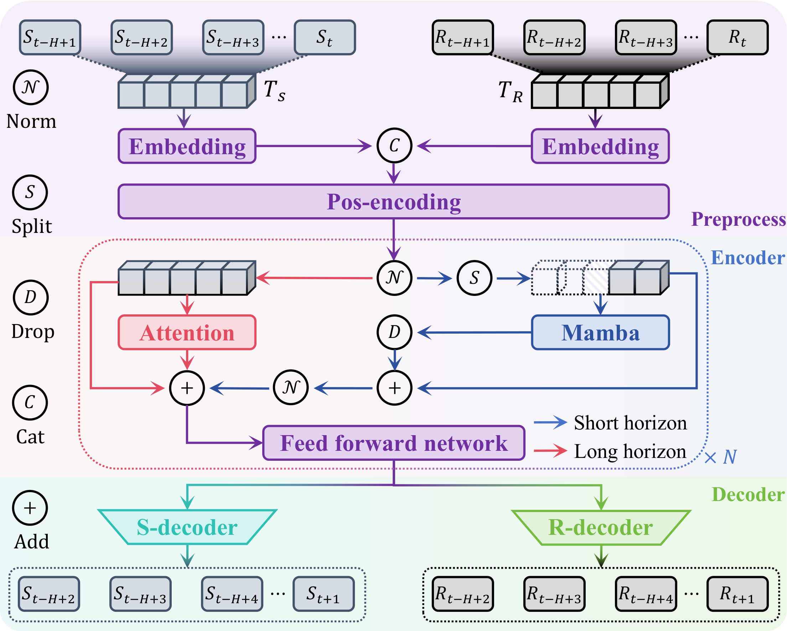

# Adaptive Planning Hierarchical Diffuser for Multi-Step Action Execution in Offline RL

## Motivation

## Autoregressive Model

  

The architecture of MTPN. After embedding, the trajectory is processed in parallel by mamba (for local features) and an attention module (for global features). The fused representations are then decoded to predict state and return-to-go.

## Architecture

  

Overview of the proposed APHD method. Given an input trajectory sequence, the MTPN first autoregressively generates a feasible trajectory. This trajectory is then refined by a hierarchical diffusion model that constructs multi-horizon temporal abstractions. The final action sequence is derived by the inverse dynamics and executed via the adaptive replanning trigger. "Skip" denotes equidistant sampling of states, and $H-1$ represents autoregressive planning steps.

## Visualization Results
### Hopper
 
hopper-medium-expert-v2

hopper-medium-replay-v2

hopper-medium-v2

### Walker2d

### Hopper
